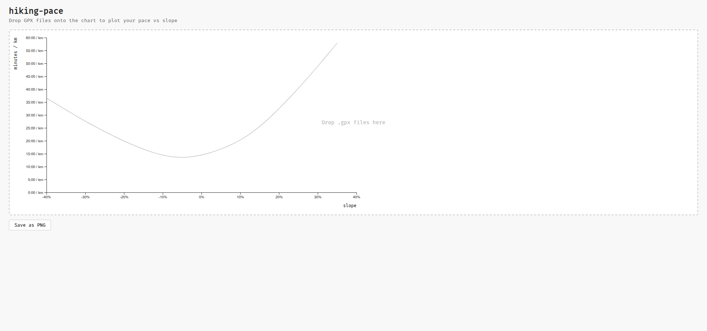

# hiking-pace

Visualise your actual hiking pace vs slope from GPX tracks, compared to the theoretical [Tobler hiking function](https://en.wikipedia.org/wiki/Tobler%27s_hiking_function).

**[Live demo →](https://fredj.github.io/hiking-pace/)**

## What it does

Drop one or more `.gpx` files onto the chart. For each track the app:

- Segments the route into chunks of at least 25 m
- Plots your actual pace (min/km) against slope (%) for each segment
- Fits a polynomial regression curve to your data
- Shows the theoretical Tobler curve in grey for reference

Useful for understanding your personal pace model or comparing multiple hikes.



## Usage

1. Open the [live demo](https://fredj.github.io/hiking-pace/)
2. Drop one or more `.gpx` files onto the chart area
3. Hover a track name to highlight its data points
4. Click **Save as PNG** to export the chart

## Run locally

```bash
npm install
npm start
```

Then open http://localhost:1234.

## Stack

JavaScript · [D3.js](https://d3js.org/) · [lit-html](https://lit.dev/) · [Turf.js](https://turfjs.org/) · [Parcel](https://parceljs.org/)
